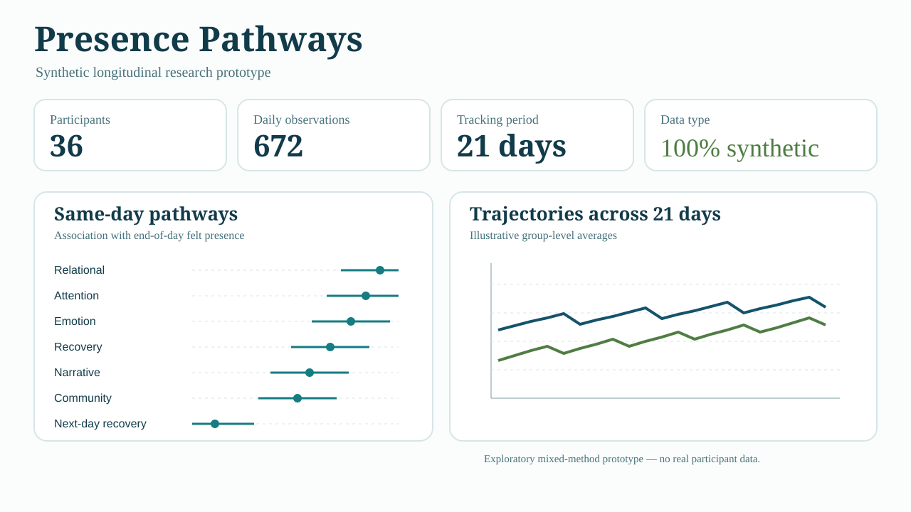
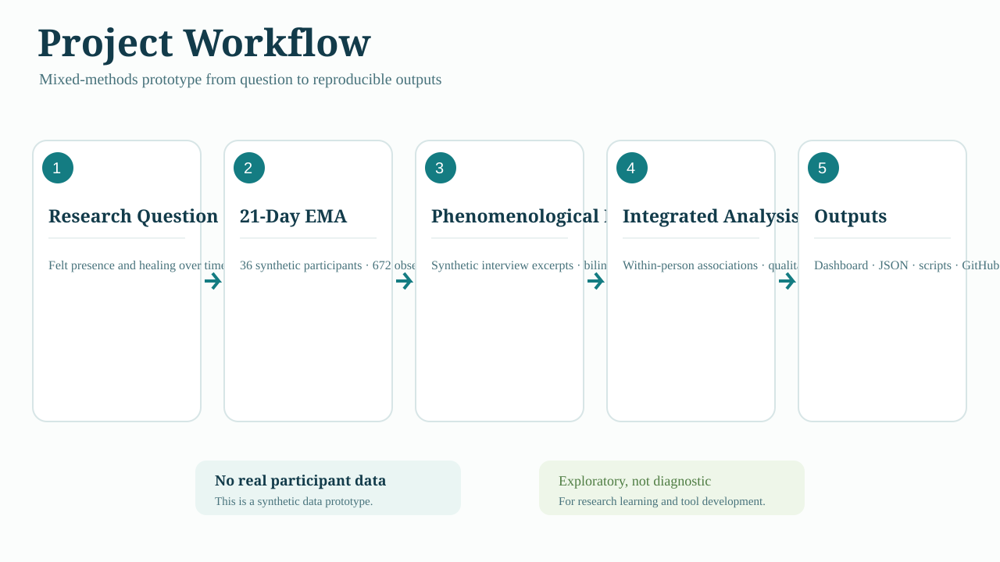
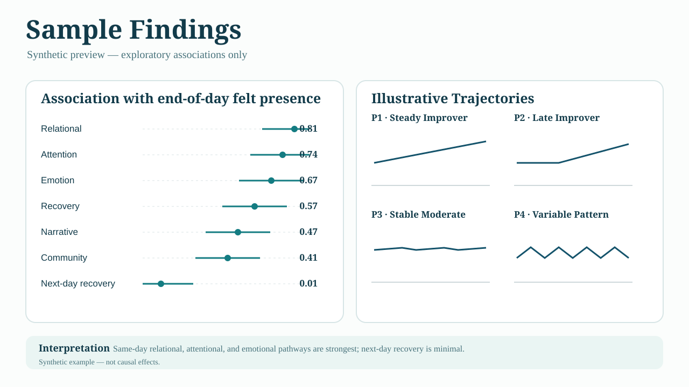
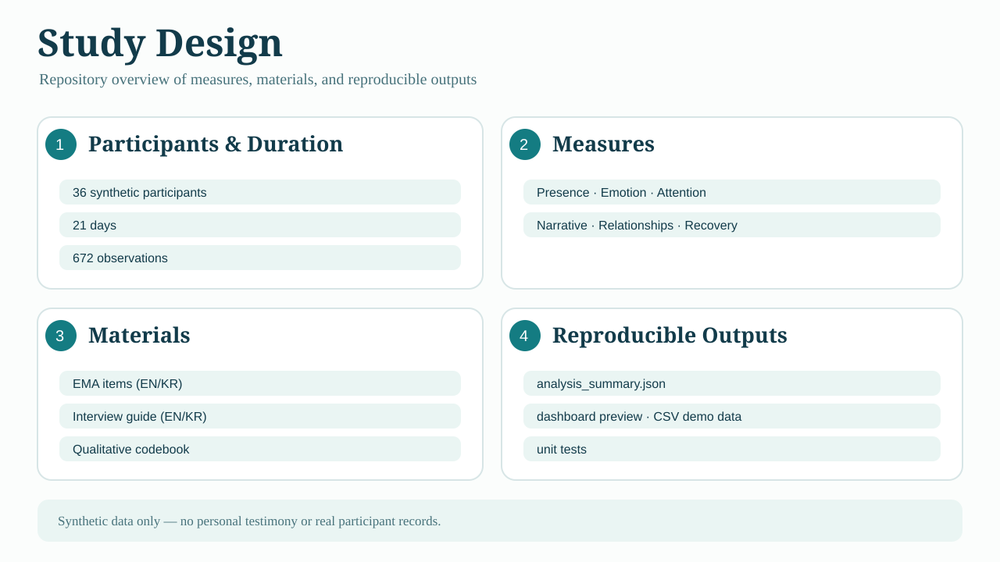
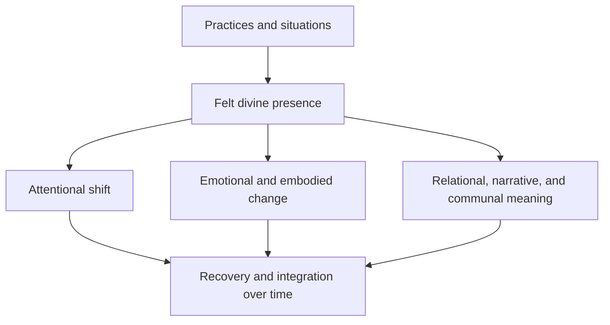

# Presence Pathways

**A mixed-methods research prototype for studying felt divine presence and psychological change over time.**

[](LICENSE)
[](data/demo)

Presence Pathways is a reproducible, human-centered toolkit for asking:

> How does an experience understood as divine grace become a process of healing, and through what attentional, emotional, relational, narrative, and communal pathways does that transformation persist?

The repository combines longitudinal experience sampling (EMA), phenomenological interview excerpts, transparent quantitative summaries, and researcher-verified qualitative coding. It deliberately **does not decide whether a spiritual experience is metaphysically real**, and it does not automatically classify an experience as healthy or pathological.

The included dataset is entirely synthetic. No real participant or personal testimony appears in this repository.



## Visual overview

### Project workflow



### Sample findings



### Study design



> All figures are explanatory visuals for the synthetic prototype. They are not real participant results and should not be interpreted as causal evidence.

## Live research demo

After enabling GitHub Pages from the `/docs` folder, the dashboard becomes a public, no-backend research demo. Locally:

```bash
python -m http.server 8000 --directory docs
```

Then open `http://localhost:8000`.

## What the project demonstrates

| Research task | Implementation |
| --- | --- |
| Capture change in everyday life | 21-day EMA structure with embodied, emotional, relational, and functional measures |
| Preserve first-person meaning | Synthetic phenomenological excerpts and a bilingual interview guide |
| Join numbers to ethnography | Within-person associations sit beside human-authored interpretive memos |
| Respect cultural context | Measures distinguish participants' interpretations from researchers' descriptions |
| Avoid overclaiming | Outputs are labeled exploratory associations, not causes, diagnoses, or proof of divine action |
| Support reproducibility | Seeded data generation, schema checks, unit tests, data dictionary, and preregistration-style analysis plan |

## Conceptual model



The conceptual model is intentionally exploratory. It separates felt presence from attentional, emotional, relational, narrative, communal, and recovery-related variables so that each pathway can be examined without treating the model as a predetermined causal explanation.

## Quick start

Python 3.10+ is recommended.

```bash
python -m venv .venv
source .venv/bin/activate  # Windows: .venv\Scripts\activate
pip install -e .
python scripts/build_demo.py
python -m unittest discover -s tests -v
```

The analysis pipeline uses NumPy and pandas. The static dashboard has no JavaScript framework or server dependency.

## Repository map

```text
presence-pathways/
├── src/presence_pathways/  # schema, synthetic data, analysis, coding, privacy
├── scripts/                # one-command reproducible demo build
├── tests/                  # standard-library unit tests
├── instruments/            # bilingual EMA items and interview guide
├── data/demo/              # generated synthetic research data
├── results/                # machine-readable analysis outputs
└── docs/                   # GitHub Pages research dashboard and protocols
```

## Reproducible analysis

`scripts/build_demo.py` performs six auditable steps:

1. Generate a synthetic longitudinal cohort.
2. Validate types, ranges, and participant-day uniqueness.
3. Compute person-centered variables.
4. Estimate same-day and next-day within-person associations.
5. Produce keyword-based *candidate* interview codes for human review.
6. Export privacy-limited JSON for the public dashboard.

The analysis emphasizes changes relative to each participant's own usual level. This reduces, but does not eliminate, confounding by stable differences between people.

## Ethical boundaries

- Do not place identifiable narratives, exact locations, or raw timestamps in a public repository.
- Do not use keyword suggestions as final qualitative coding.
- Do not treat a score as a diagnosis or a spiritual truth claim.
- Distressing, coercive, or function-impairing experiences require a participant-centered safety protocol and appropriate clinical referral.
- Real research requires institutional ethics review, community consultation, informed consent, and a data management plan.

See [Ethics and reflexivity](docs/ethics.md), [Research protocol](docs/research_protocol.md), [Analysis plan](docs/analysis_plan.md), and the [Project overview](PROJECT_OVERVIEW.md).

## Korean overview

이 프로젝트는 사람들이 ‘하나님의 임재’ 또는 ‘은혜’라고 해석하는 경험이 일상에서 어떻게 느껴지고, 어떤 과정을 거쳐 평안·감사·사랑받는 느낌·걱정 완화·회복으로 이어지는지를 혼합방법론으로 연구하기 위한 공개형 프로토타입입니다. 숫자는 체험의 의미를 대신하지 않고, 인터뷰와 민족지적 해석을 보조합니다. 모든 데모 자료는 합성 자료입니다.

## Author and license

Created by **Minhyeong Yun** as an independent research software project. Code is released under the [MIT License](LICENSE). Synthetic data are released under [CC BY 4.0](data/demo/LICENSE_DATA.md).